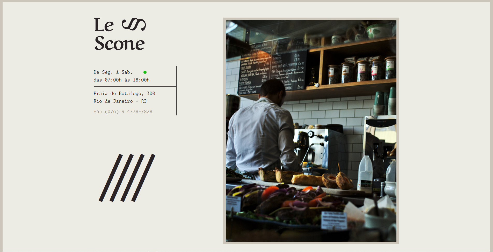

<h1 align="center">Le Scone</h1>

<!-- 

  

  

  

  

  

 

 -->

<!-- Status -->

<!-- <h4 align="center">
	🚧  Rocketnews 🚀 Under construction...  🚧
</h4>

 -->

  <a href="#dart-about">About</a> &#xa0; | &#xa0; 
  <a href="#sparkles-features">Features</a> &#xa0; | &#xa0;
  <a href="#rocket-technologies">Technologies</a> &#xa0; | &#xa0;
  <a href="#white_check_mark-requirements">Requirements</a> &#xa0; | &#xa0;
  <a href="#checkered_flag-starting">Starting</a> &#xa0; | &#xa0;
  <a href="#memo-license">License</a> &#xa0; | &#xa0;
  <a href="https://github.com/{{YOUR_GITHUB_USERNAME}}" target="_blank">Author</a>

 
  

&#xa0;

  <!-- <a href="https://rocketnews.netlify.app">Demo</a> -->

 

## :dart: About

O Le Scone is a project study in SASS proposed by @Origamid.

## :sparkles: Features

:heavy_check_mark: Import;\
:heavy_check_mark: Variable;\
:heavy_check_mark: Nesting;\
:heavy_check_mark: Mixins;\
:heavy_check_mark: Extend;\
:heavy_check_mark: Operators;\
:heavy_check_mark: Conditionals;\
:heavy_check_mark: Functions;\
:heavy_check_mark: Loop;

## :rocket: Technologies

The following tools were used in this project:

- [SASS](https://sass-lang.com/)

## :white_check_mark: Requirements

Before starting :checkered_flag:, you need to have [Browser](https://www.google.com/intl/pt-BR/chrome/) and [Code Editor "vscode"](https://code.visualstudio.com/) installed.

## :checkered_flag: Starting

Use the plugin Go Live [use](https://marketplace.visualstudio.com/items?itemName=ritwickdey.LiveServer) for init of HTML

## :memo: License

This project is under license from MIT. For more details, see the [LICENSE](LICENSE.md) file.

Made with 💜 by <a href="https://github.com/{{YOUR_GITHUB_USERNAME}}" target="_blank">Eliveuton Souza</a>

&#xa0;

<a href="#top">Back to top</a>
